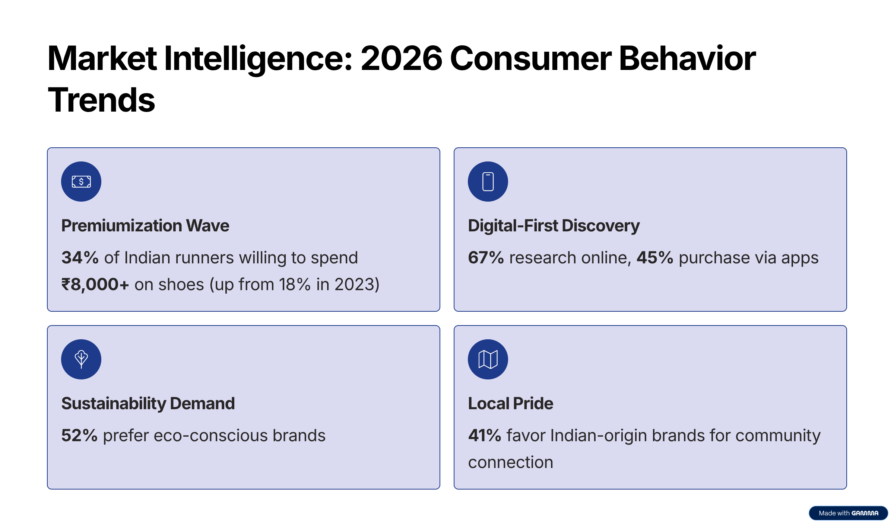
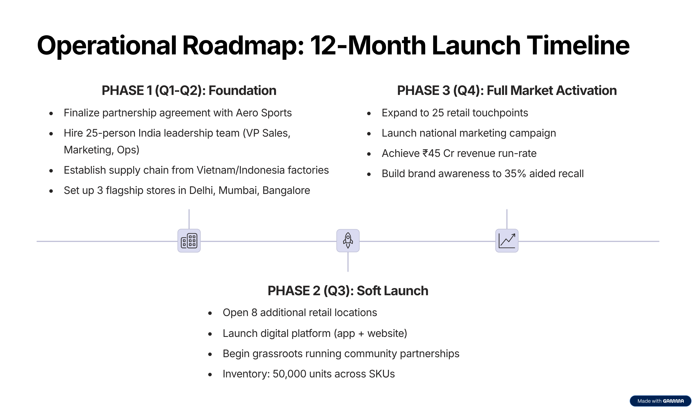
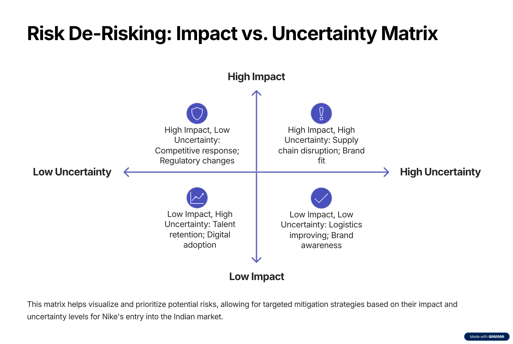

# 👟 Nike India: Expansion Blueprint 2026
**Strategic Market Entry & Investment Proposal**

## 📌 Project Overview
This repository contains a comprehensive strategic proposal for **Nike's entry into India's premium running market**. The project analyzes market gaps, competitive landscapes, and financial viability to provide a 3-year execution roadmap.

### 🎯 Strategic Recommendation
> **"Proceed with Hybrid GTM Strategy"** – Leverage a local partnership (Aero Sports) for speed and risk mitigation, with a clear path to majority control by Year 3.

---

## 📊 Key Highlights from the Blueprint

### 1. The "Brutal Why Now?"
India's premium running market is growing at **23% YoY**, yet Nike's market share (<8%) lags behind Adidas (12%) and local players (35%). 
* **Market Opportunity:** ₹2,400 Cr by 2028.
* **Target Segment:** 34% of Indian runners are now willing to pay premium prices for high-performance gear.

### 2. Financial Projections & ROI
* **Year 1 Investment:** ₹165 Cr.
* **Internal Rate of Return (IRR):** 42%.
* **Payback Period:** 2.8 Years.
* **Revenue Target:** ₹380 Cr by Year 3.

### 3. Success Metrics (KPIs)
* **Market Share:** 10% target by Year 3.
* **Footprint:** 25 retail stores by Q4 2026.
* **Digital Growth:** 40% of sales via digital channels by Year 2.

---

## 🖼️ Strategy Deck Preview
*(To display images here, export your slides as PNGs and upload them to an `/images` folder in this repo)*

### Market Intelligence & Gap Analysis

### Operational Roadmap

### Risk Mitigation Matrix

---

## 📂 Repository Contents
* `EXPANSION-BLUEPRINT.pptx` - The complete 20-slide executive presentation.
* `/images` - High-resolution slide exports for quick viewing.

## 👤 Prepared By
**Rebecca Rodrigues** Nike Strategic Planning | February 2026

---
*Disclaimer: This project was developed as a strategic simulation for market expansion analysis.*

